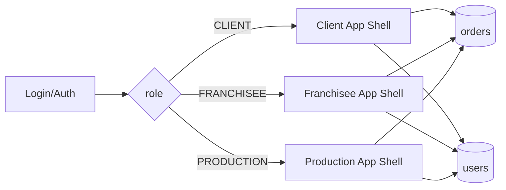

# Архитектура MVP AVISHU Superapp

## 1. Архитектурный принцип

Единая кодовая база, единый экран авторизации, после логина — маршрутизация в интерфейс по роли.

## 2. Модули

1. **Auth module**
   - Firebase Auth.
   - Получение `role` из `users/{uid}`.

2. **Role Router**
   - Guard/redirect в нужный shell.
   - Запрет доступа к чужим экранам.

3. **Orders module**
   - Создание заказа клиентом.
   - Канбан франчайзи с фильтрами по статусу.
   - Планшет цеха с активной задачей.

4. **Realtime sync**
   - Firestore `onSnapshot` для `orders`.
   - Мгновенная синхронизация статусов.

5. **Design system (AVISHU)**
   - Только черный/белый/серый.
   - Верхний регистр заголовков.
   - Минимум скруглений, тонкие разделители.

## 3. Cостояния заказа

- `PLACED` — клиент оформил.
- `IN_PROGRESS` — франчайзи взял в работу.
- `SEWING` — задача в цеху.
- `DONE` — готово.

## 4. Событийная модель

- `OrderCreated`
- `OrderAcceptedByFranchisee`
- `OrderMovedToProduction`
- `OrderCompleted`

## 5. Нефункциональные требования

- Обновление UI по событиям < 1 сек в локальной сети.
- Кнопки в производственном интерфейсе — крупные и контрастные.
- Минимум кликов для выполнения действия (не более 2).
